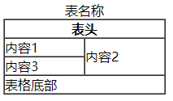

# HTML常用标签
## a标签
超链接标签：[参考mdn网址](https://developer.mozilla.org/zh-CN/docs/Web/HTML/Element/a)
``` html
<a href="url" target="_blank" >我是a标签</a>
<a href="mailto:m.bluth@example.com">Email</a>  
<a href="tel:+123456789">Phone</a>
```
url ：
* https协议网址
* http协议网址
* //google.com 无协议网址（建议使用）
* javascript:;（伪协议）
* /a/b/c  or a/b/c 路径（基于根目录）
* #nav 锚点
* 邮箱、电话
  
target属性:
* _self 默认本窗口打开
* _blank 新窗口打开
* _top 顶窗口打开（配合iframe使用）
* _parent 父窗口打开（配合iframe使用）

## img标签
图像标签：[参考mdn网址](https://developer.mozilla.org/zh-CN/docs/Web/HTML/Element/img)

``` html

```


src : 图片嵌入的路径（会发出get请求）
alt : 若图片没有加载出来，则显示文字内容
title : 当鼠标经过图片时候，显出文字内容

### 注意：img图片只能设置 width 或 height , 图片大小300kb以下。

## table标签
表格标签：[参考mdn网址](https://developer.mozilla.org/zh-CN/docs/Web/HTML/Element/table)

``` html
<table border="1" width="200" 
       cellspacing="0" cellpadding="0">
    <caption>表名称</caption>
    <thead>
        <tr>
            <th colspan="2">表头</th>
        </tr>
    </thead>
    <tbody>
        <tr>
            <td>内容1</td>
            <td rowspan="2">内容2</td>
        </tr>
        <tr>
            <td>内容3</td>
        </tr>
    </tbody>
    <tfoot>
          <tr>
            <td colspan="2">表格底部</td>
        </tr>
    </tfoot>
</table>
```


### table 属性：
* border ：表格线框
* width ： 表格宽度
* cellspacing ： 每个单元格之间的距离
* cellpadding ： 内容与边框的距离
* colspan : 合并列
* rowspan : 合并行

### table CSS相关
```css
    table{
        table-layout:auto 根据内容  fixed 尽量平均
        border-collapse:collapse 合并表格线框
        border-spacing:0 边框距离为0
    }
```
## 注意：table中不能直接写tr，可省略thead、tfoot，若不写tbody，则浏览器会强行纠错把内容放置在tbody中